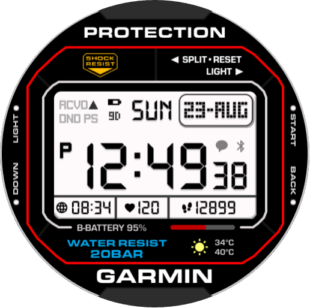
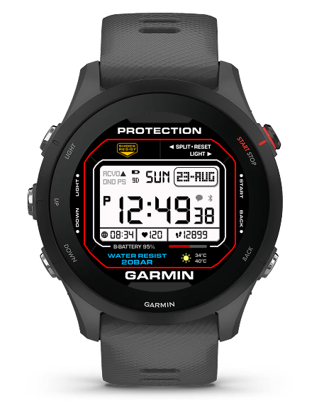
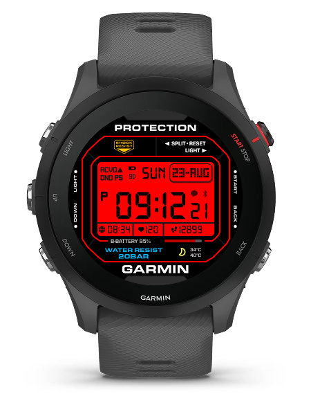
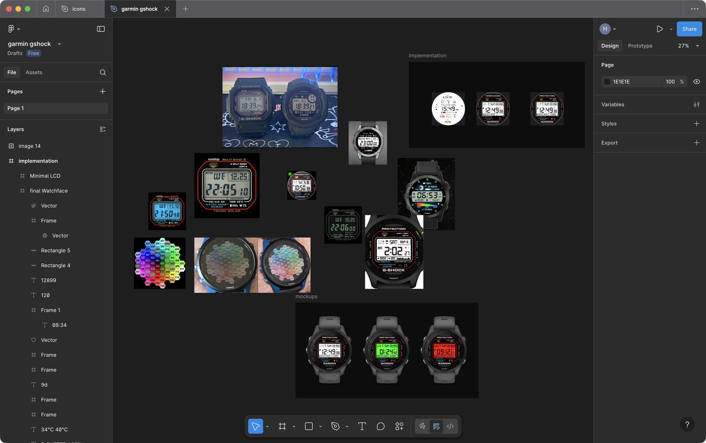

  

<h1 align="center">gshock watch face for garmin</h1>

  
  
  

---

## what is this?

a g-shock inspired watch face for garmin watches, specifically designed for the mip display of the forerunner 255 and other models with 260x260 displays.

i love the mip display on my garmin (i have a forerunner 255) and i missed having the retro lcd look of my casio and g-shock watches. there were some casio-style faces on the connect iq store, but they weren't as customizable as i wanted. so i made my own.

this watch face replicates the classic g-shock digital watch aesthetic with all the data fields you need for daily use and workouts.

---

## features

- **3 color themes**: original (grey), red, and green
- **complete data display**:
  - battery life in days
  - day of week and date
  - large time display with am/pm indicator
  - seconds display
  - notification and bluetooth status indicators
  - world time (default set to EST)
  - heart rate monitoring
  - step counter with progress bar
  - body battery percentage
  - weather with temperature and feels like
- **custom fonts**: uses eurostile, technology, and trs million fonts to match the g-shock aesthetic
- **optimized for mip displays**: the colors probably look super bright here cause they're designed to look normal on garmin's mip screen lol

---

### design process

  

the entire design was created in figma. you can check out all the svgs and components here:
[**figma design link**](https://www.figma.com/design/HQZiLoewHLv4LCyWn4ipz6/garmin-gshock?node-id=46-279&t=uZAsZONLAkhuWvjV-1)

### color calibration

    
    

the colors look very bright on regular screens, but this is intentional. the garmin mip display has different color reproduction, and these bright colors translate to the perfect tones on the actual watch. [credit](https://www.reddit.com/r/GarminWatches/comments/1g0p0e0/comment/lrayu95)

---

## installation

### manual installation

1. download the `.prg` file from [releases](https://github.com/hritsh/garmin-gshock/releases) the `export/` folder
2. connect your garmin watch to your computer (use openMTP if you're on mac)
3. copy the `.prg` file to the `GARMIN/Apps` folder on your watch
4. disconnect and select the watch face in your garmin settings

---

## customization

you can change the color theme in the watch face settings:

- **original (grey)**: classic g-shock look
- **green**: green lcd inspired by the [timex expedition cat5 t49949](https://timex.eu/products/expedition-cat5-40mm-leather-and-fabric-strap-watch-tw4b30300)
- **red**: red lcd inspired by the [casio g-shock dw-5600](https://www.casio.com/uk/watches/gshock/product.DW-5600BBR-1/)

---

## technical details

### fonts used

- **eurostile** (8pt) - tiny font for labels and small text
- **technology** (23pt, 48pt) - lcd-style font for time and day
- **trs million** (16pt, 18pt) - dot matrix font for data fields

---

## compatibility

designed and tested for:

- **garmin forerunner 255**

may work on other garmin devices with similar screen dimensions (260x260px), but not guaranteed.

---

## development

built with:

- **monkey c** - garmin's programming language
- **connect iq sdk** - garmin's development kit
- **figma** - for design and assets
- **pixelmator pro** - for creating the watchface background

---

## license

MIT

---

  <a href="https://github.com/hritsh/garmin-gshock" title="github repo">
    github.com/hritsh/garmin-gshock
  </a>

